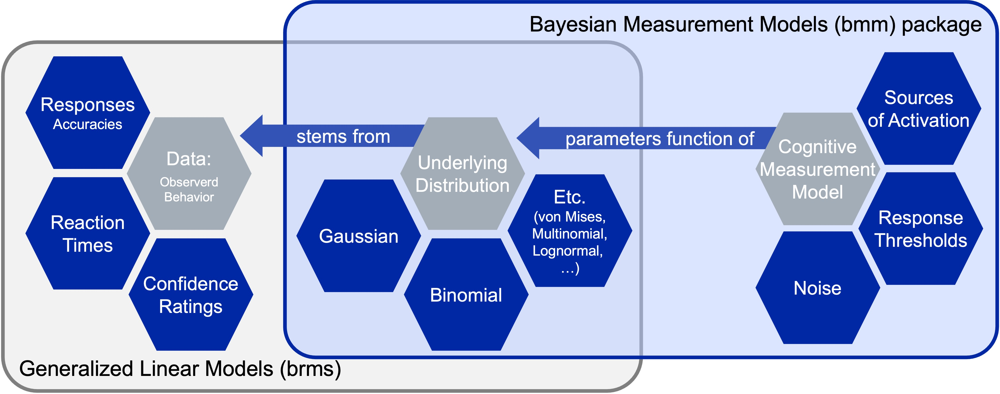
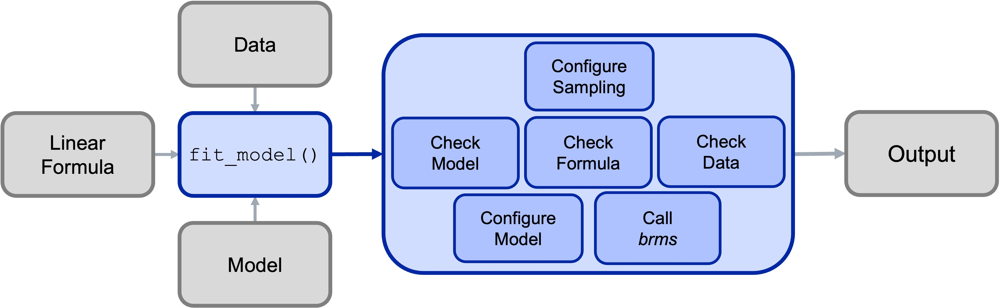

<!-- README.md is generated from README.Rmd. Please edit that file -->
```{r, include = FALSE}
knitr::opts_chunk$set(
  collapse = TRUE,
  comment = "#>",
  fig.path = "man/figures/README-",
  out.width = "100%"
)
```
# bmm   <!-- badges: start -->
[](https://github.com/venpopov/bmm/actions/workflows/R-CMD-check.yaml)
[](https://github.com/venpopov/bmm/actions/workflows/test-coverage.yaml)
<!-- badges: end -->

## Overview

The goal of the `bmm` (Bayesian Measurement Models) package is to make it easier
to estimate common cognitive measurement models for behavioral research. It
achieves this by combining the flexibility of the ‘brms’ package for specifying
linear model syntax with custom functions that translate cognitive measurement
model into distributional families that can be estimated using Bayesian
hierarchical estimation. Cognitive measurement models provide a more refined
representation of the cognitive processes underlying observed behavior, because
they decompose observed behavior into several theoretically meaningful
parameters that each represent distinct cognitive processes.


## Available models

Currently the bmm package implements mainly models used in the domain of visual
working memory research:

```{r, results="asis", echo=FALSE}
bmm::print_pretty_models_md()
```


However, the setup of the bmm package provides the foundation for the
implementation of a broad range of cognitive measurement models. In fact, we are
already working on implementing additional models, such as:

- Signal-Detection Models
- Evidence Accumulation Models
- Memory Models for categorical response

If you have suggestions for models that should be added to the package, feel
free to create an issue. Ideally this should describe the model, point towards
literature that gives details on the model, and if possible link to code that
has already implemented the model.

Given the dynamic nature the bmm package is currently in, you can always view
the latest list of supported models by running:

```{r}
bmm::supported_models()
```

## Installation 

Currently, we are working on getting the package ready to be submitted to CRAN.
For now, you have to install the development version of bmm from
[GitHub](https://github.com/) with:

``` r
# install.packages("devtools")
devtools::install_github("venpopov/bmm")
```

All the vignettes are also available on the [bmm
website](https://venpopov.github.io/bmm/).

The package was significantly updated on Feb 03, 2024. If you are following
older versions (earlier than Version 6) of the [Tutorial
preprint](https://osf.io/preprints/psyarxiv/umt57), you need to install the
0.0.1 version of the bmm package with:

``` r
# install.packages("devtools")
devtools::install_github("venpopov/bmm@v0.0.1")
```

## The general structure of the bmm package

The main building block of the bmm package is that cognitive measurement models
can often be specified as distributional models for which the distributional
parameters of the generalized linear mixed model are a function of cognitive
measurement model parameters. These functions that translate the cognitive
measurement model parameters into distributional parameters is what we
implement in the bmm package.


```{r bmm-logic, echo=F, fig.cap="", out.width=600, fig.align = 'center'}

```

As these function can become complicated and their implementation changes with
differences in experimental designs, the bmm package provides general
translation functions that eases the use of the cognitive measurement models for
end users. This way researchers that face challenges in writing their own STAN
code to implement such models themselves can still use these models in almost
any experimental design.

### Fitting models using the bmm

The core function of the bmm package is the `fit_model` function. This function
takes:

1. a linear model formula specifying how parameters of the model should vary as
a function of experimental conditions
2. data containing the dependent variables, the variables predicting model
parameters, and potentially additional variables providing information to
identify the model
3. the model that should be fit

You can get more detailed information on the models implemented in bmm by
invoking the documentation of each model typing `?bmmmodel` into your console.
For example, calling the information on the full version of the Interference
Measurement Model would look like this:

``` r
?IMMfull
```

The function will then call the appropriate functions for the specified model
and will perform several steps:

1. Configure the Sample (e.g., set up prallelization)
2. Check the information passed to the `fit_model` function:
    - if the model is installed and all required arguments were provided
    - if a valid formula was passed
    - if the data contains all necessary variables
3. Configure the called model (including specifying priors were necessary)
4. Calling `brms` and passing the specified arguments
5. Posprocessing the output and passing it to the user

This process is illustrated in the Figure below:

```{r fitModel, echo=F, fig.cap="", out.width=600, fig.align = 'center'}

```

A complete call to fit a model using bmm could look like this. For this example,
we are using the `OberauerLin_2017` data that is provided with the package.

``` r
library(bmm)
data <- OberauerLin_2017
```

For this quick example, we will show hot to setup fitting the Interference
Measurement Model to this data. If you want a detailed description of this model
and and in depth explanation of the parameters estimated in the model, please
have a look at `vignette("IMM")`.

``` r
model_formula <- brms::bf(dev_rad ~ 1,
                          c ~ 0 + SetSize,
                          a ~ 0 + SetSize,
                          s ~ 0 + SetSize,
                          kappa ~ 0 + SetSize)

model <- IMMfull(non_targets = paste0("Item",2:8,"_Col"),
                 spaPos = paste0("Item",2:8,"_Pos"))

fit <- fit_model(
  formula = model_formula,
  data = data,
  model = model
)
```

Using this call, the `fit` object will save all the information about the fitted
model. As `bmm` calls `brms` to fit the models, these objects can be handled the
same way a normal `brmsfit` object is handled:

``` r
# print summary
summary(fit)

# plot posterior predicitive plot
brms::pp_check(fit)
```

You can have a look at examples for how to fit all currently implemented models
by reading the vignettes for each model [here for the released version of the
package](https://venpopov.github.io/bmm/articles/index.html) or [here for the
development version](https://venpopov.github.io/bmm/dev/articles/index.html).


### Exploring cogntive measurement models

To aid users in improving their intuition about what different models predict
for observed data given a certain parameter set, the `bmm` package also includes
density and random generation function for all implemented models.

These function provide an easy way to see what a model predicts for data given a
certain set of parameters. For example you can easily plot the probability
density function of the data for the Interference Measurement model using the
`dIMM` function. In similar fashion the random generation function included for
each model, generates random data based on a set of data generating parameters.
For the IMM, you can use `rIMM` to generate data given a set of parameters.
Plotting the random data against the density illustrates that the data follows
the theoretically implied density.

```{r message=FALSE, warning=FALSE, out.width=400}
library(ggplot2)

simData <- data.frame(
  x = bmm::rIMM(n = 500,
           mu = c(0,-1.5,2.5,1),
                            dist = c(0, 2, 0.3, 1),
                            c = 1.5, a = 0.3, b = 0, s = 2, kappa = 10)
)

ggplot(data = simData, aes(x = x)) +
  geom_histogram(aes(y = after_stat(density))) +
  geom_function(fun = bmm::dIMM,
                args = list(mu = c(0,-1.5,2.5,1),
                            dist = c(0, 2, 0.3, 1),
                            c = 1.5, a = 0.3, b = 0, s = 2, kappa = 10)) +
  scale_x_continuous(limits = c(-pi,pi))
```


## Contributing to the `bmm` package

Should be interested in contributing a model to the `bmm` package, you should
first look into the [Developer
Notes](https://venpopov.github.io/bmm/dev/dev-notes/index.html). These give a
more in depth description of the package architecture and the steps necessary to
add your own model to the package.

