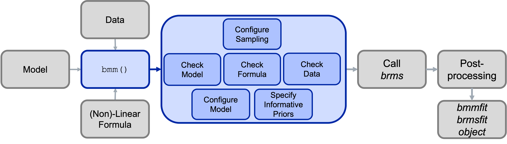

<!-- README.md is generated from README.Rmd. Please edit that file -->

# bmm <!-- badges: start -->

[](https://popov-lab.r-universe.dev/bmm)
[](https://github.com/venpopov/bmm/actions/workflows/R-CMD-check.yaml)
[](https://github.com/venpopov/bmm/actions/workflows/test-coverage.yaml)
<!-- badges: end -->

## Overview

The goal of the `bmm` (Bayesian Measurement Models) package is to make
it easier to estimate common cognitive measurement models for behavioral
research. It achieves this by combining the flexibility of the ‘brms’
package for specifying linear model syntax with custom functions that
translate cognitive measurement model into distributional families that
can be estimated using Bayesian hierarchical estimation. Cognitive
measurement models provide a more refined representation of the
cognitive processes underlying observed behavior, because they decompose
observed behavior into several theoretically meaningful parameters that
each represent distinct cognitive processes.

## Getting started

See the following sections for more information on the `bmm` package:

- [Available models](#available-models)
- [How to install bmm](#how-to-install-bmm)
- [Fitting models using bmm](#fitting-models-using-bmm)
- [Exploring cogntive measurement
  models](#exploring-cogntive-measurement-models)
- [The general structure of the bmm
  package](#the-general-structure-of-the-bmm-package)
- [Contributing to the `bmm` package](#contributing-to-the-bmm-package)

## Available models

Currently the bmm package implements mainly models used in the domain of
visual working memory research:

**Visual working memory**

- Interference measurement model by Oberauer and Lin (2017).
- Two-parameter mixture model by Zhang and Luck (2008).
- Three-parameter mixture model by Bays et al (2009).
- Signal Discrimination Model (SDM) by Oberauer (2023)

However, the setup of the bmm package provides the foundation for the
implementation of a broad range of cognitive measurement models. In
fact, we are already working on implementing additional models, such as:

- Signal-Detection Models
- Evidence Accumulation Models
- Memory Models for categorical response

If you have suggestions for models that should be added to the package,
feel free to create an issue. Ideally this should describe the model,
point towards literature that gives details on the model, and if
possible link to code that has already implemented the model.

Given the dynamic nature the bmm package is currently in, you can always
view the latest list of supported models by running:

``` r
bmm::supported_models()
#> The following models are supported:
#> 
#> -  imm(resp_error, nt_features, nt_distances, set_size, regex, version) 
#> -  mixture2p(resp_error) 
#> -  mixture3p(resp_error, nt_features, set_size, regex) 
#> -  sdm(resp_error, version) 
#> 
#> Type  ?modelname  to get information about a specific model, e.g.  ?imm
```

## How to install bmm

You can install the latest version of the `bmm` package from CRAN:

``` r
install.packages("bmm")
```

Because `bmm` is based on `brms` and `stan` it requires a working C++
compiler. If you have not used `brms` before, you will need to first
install the dependencies. If you are already using `brms`, you can skip
this step.

<details>
<summary>
<b> Install dependencies</b>
</summary>

</br>

- Install and configure a C++ compiler. Detailed instructions
  [here](https://github.com/stan-dev/rstan/wiki/RStan-Getting-Started#configuring-c-toolchain)
- Install
  [rstan](https://github.com/stan-dev/rstan/wiki/RStan-Getting-Started)
  and/or
  [cmdstanr](https://mc-stan.org/cmdstanr/articles/cmdstanr.html). We
  recommend using `cmdstanr`.
- Install [brms](https://paul-buerkner.github.io/brms/#installation)

</details>

</br> Alternatively, you can install the development version of the
package or a specific version of the package from GitHub:

<details>
<summary>
<b>Install the latest development version of bmm</b>
</summary>

</br>

``` r
if (!requireNamespace("remotes")) {
  install.packages("remotes")
}
remotes::install_github("venpopov/bmm")
```

</details>
<details>
<summary>
<b>Install the 0.0.1 version of bmm (if following version 6 of the
tutorial paper on OSF)</b>
</summary>

</br>

The package was significantly updated on Feb 03, 2024. If you are
following older versions (earlier than Version 6) of the [Tutorial
preprint](https://osf.io/preprints/psyarxiv/umt57), you need to install
the 0.0.1 version of the bmm package with:

``` r
if (!requireNamespace("remotes")) {
  install.packages("remotes")
}
remotes::install_github("venpopov/bmm@v0.0.1")
```

</details>

## Fitting models using bmm

The core function of the bmm package is the `bmm()` function. This
function takes:

1.  a linear model formula specifying how parameters of the model should
    vary as a function of experimental conditions
2.  data containing the dependent variables, the variables predicting
    model parameters, and potentially additional variables providing
    information to identify the model
3.  the model that should be fit

You can get more detailed information on the models implemented in bmm
by invoking the documentation of each model typing `?bmmodel` into your
console. For example, calling the information on the full version of the
Interference Measurement Model would look like this:

``` r
?imm
```

A complete call to fit a model using bmm could look like this. For this
example, we are using the `oberauer_lin_2017` data that is provided with
the package and we will show how to fit the Interference Measurement
Model to this data. If you want a detailed description of this model and
and in depth explanation of the parameters estimated in the model,
please have a look at [the IMM
article](https://venpopov.github.io/bmm/articles/bmm_imm.html).

``` r
library(bmm)

formula <- bmmformula(c ~ 0 + set_size,
                      a ~ 0 + set_size,
                      s ~ 0 + set_size,
                      kappa ~ 0 + set_size)

model <- imm(resp_error = "dev_rad",
             nt_features = paste0("col_nt", 1:7),
             nt_distances = paste0("dist_nt",1:7),
             set_size = "set_size")

fit <- bmm(formula = formula, data = data, model = model)
```

Using this call, the `fit` object will save all the information about
the fitted model. As `bmm` calls `brms` to fit the models, these objects
can be handled the same way a normal `brmsfit` object is handled:

``` r
# print summary
summary(fit)

# plot posterior predicitive plot
brms::pp_check(fit)
```

You can have a look at examples for how to fit all currently implemented
models by reading the vignettes for each model [here for the released
version of the
package](https://venpopov.github.io/bmm/articles/index.html) or [here
for the development
version](https://venpopov.github.io/bmm/dev/articles/index.html).

## Exploring measurement models

To aid users in improving their intuition about what different models
predict for observed data given a certain parameter set, the `bmm`
package also includes density and random generation function for all
implemented models.

These function provide an easy way to see what a model predicts for data
given a certain set of parameters. For example you can easily plot the
probability density function of the data for the Interference
Measurement model using the `dimm` function. In similar fashion the
random generation function included for each model, generates random
data based on a set of data generating parameters. For the IMM, you can
use `rimm` to generate data given a set of parameters. Here is an
example of how to use these functions. We are ploting a histogram of
randomly generated data from the IMM with a setsize of four, and
overlaying the probability density function of the model:

``` r
library(bmm)
library(ggplot2)

resp <- rimm(
  n = 1000,
  mu = c(0, -1.5, 2.5, 1),
  dist = c(0, 2, 0.3, 1),
  c = 1.5, a = 0.3, b = 0, s = 2, kappa = 10
)

hist(resp, freq = FALSE, breaks = 60)
curve(
  dimm(x,
    mu = c(0, -1.5, 2.5, 1), 
    dist = c(0, 2, 0.3, 1), 
    c = 1.5, a = 0.3, b = 0, s = 2, kappa = 10
  ),
  from = -pi, to = pi, add = TRUE
)
```


## The general structure of the bmm package

The main building block of the bmm package is that cognitive measurement
models can often be specified as distributional models for which the
distributional parameters of the generalized linear mixed model are a
function of cognitive measurement model parameters. These functions that
translate the cognitive measurement model parameters into distributional
parameters is what we implement in the bmm package.


As these function can become complicated and their implementation
changes with differences in experimental designs, the bmm package
provides general translation functions that eases the use of the
cognitive measurement models for end users. This way researchers that
face challenges in writing their own STAN code to implement such models
themselves can still use these models in almost any experimental design.

Under the hood, the main `bmm()` function will then call the appropriate
functions for the specified model and will perform several steps:

1.  Configure the Sample (e.g., set up prallelization)
2.  Check the information passed to the `bmm()` function:
    - if the model is installed and all required arguments were provided
    - if a valid formula was passed
    - if the data contains all necessary variables
3.  Configure the called model (including specifying priors were
    necessary)
4.  Calling `brms` and passing the specified arguments
5.  Posprocessing the output and passing it to the user

This process is illustrated in the Figure below:



## Contributing to the `bmm` package

Should be interested in contributing a model to the `bmm` package, you
should first look into the [Developer
Notes](https://venpopov.github.io/bmm/dev/dev-notes/index.html) as well
as the [Contributor
Guidelines](https://github.com/venpopov/bmm/blob/develop/.github/CONTRIBUTING.md).
These give a more in depth description of the package architecture, the
steps necessary to add your own model to the package, and how
contributions will be acknowledged.
