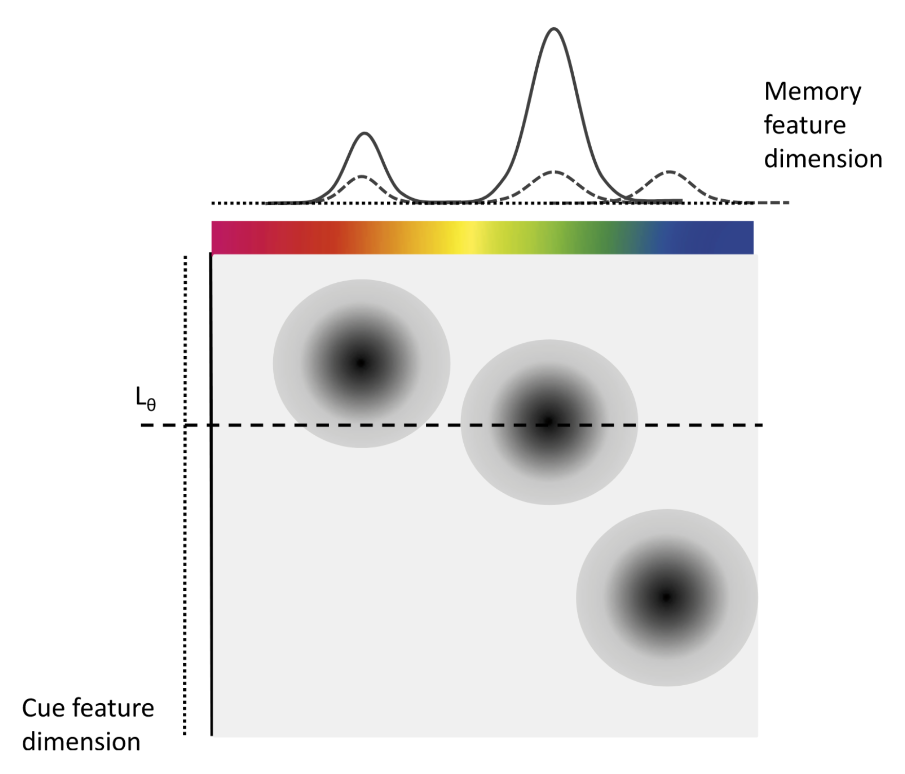

<style type="text/css">
div.main-container {
max-width: 800px !important;
}

p {
margin-top: 1.5em ;
margin-bottom: 1.5em ;
}
</style>

```{r, include = FALSE}
knitr::opts_chunk$set(
  collapse = TRUE,
  comment = "#>"
)
```

# Introduction to the model

The Interference Measurement Model (IMM) is a measurement model for continous reproduction tasks in the domain of visual working memory. The model was introduced by @oberauerHierarchicalBayesianMeasurement2017 . The aim of the IMM is to capture the response behavior in continuous reproduction tasks including the occurrence of swap errors to other items encoded in visual working memory.

The IMM assumes that during retrieval, to-be-remembered items or features (e.g., colors, orientations, or shapes) are associated with the context they appeared in (e.g. the spatial location). These associations can be continuous in their strength and represent bindings between the contents and context of to-be-remembered information (see Figure \@ref(fig:imm-illustration)). At retrieval there are different sources of activation that contribute to the activation of the to-be-retrieved contents. Background noise (b) uniformly activates all possible responses, for example all 360 colors that participants can chose from in a color wheel experiment. Cue-independent activation (a) equally activates all features that were encoded into visual working memory during retrieval. And cue-dependent activation (c) activates the features that are associated with the current retrieval cue (e.g., the spatial location cued to be retrieved). Additionally, the IMM assumes that cue-dependent activation follows a generalization gradient (s) that activates similar contexts.

```{r imm-illustration, echo=F, fig.cap="Illustration of the IMM from Oberauer et al. (2017)", out.width=450, fig.align = 'center'}

```

The activation for each potential feature $x$ that could be retrieved is the sum of the weighted activation from all three activation sources, given a retrieval cue $L$ at the location $\theta$:

$$
A(x|L_\theta) = b \times A_b(x) + a \times A_a(x) + c \times A_c(c|L_\theta)
$$

The background activation ($A_b$) is independent from all encoded features and thus modeled as a uniform distribution around the circular feature space. This is implemented as a von-Mises (vM) distribution centered on 0\footnote{As this is a uniform distribution the location does not matter and could be fixed to an arbitrary value.} with a precision $\kappa = 0$:

$$
A_b(x) = vM(x,0,0)
$$

The cue-independent activation ($A_a$) is modeled as the sum of von Mises distributions centered on the feature values $x_i$ of all $n$ encoded items $i$ with the precision of memory \kappa:

$$
A_a(x) = \sum^n_{i = 1} vM(x,x_i,\kappa)
$$

The cue-dependent activation ($A_c$) is again modeled as the sum of von Mises distributions centered on the feature values $x_i$ of all $n$ encoded items $i$ with the precision of memory \kappa. These distributions are weighted by the spatial distance $D$ between the context $L$ a feature was associated with to the cue context $L_\theta$. This distance is weighted by the generalization gradient $s$ that captures the specificity of bindings to the cue dimension:

$$
A_c(x|L_\theta) = \sum^n_{i = 1} e^{-s*D(L,L\theta)} \times vM(x,x_i,\kappa)
$$

The probability for choosing each response $\hat{x}$ then results from normalizing the activation for all possible responses $N$. In the original publication of the IMM this was done using Luce's choice rule:

$$
P(\hat{x}|L_\theta) = \frac{A(\hat{x}|L_\theta)}{\sum^N_{j=1}A(j|L_\theta)}
$$

In the `bmm` package, we decided to implement an alternative normalization using the `softmax` normalization:

$$
P(\hat{x}|L_\theta) = \frac{e^{A(\hat{x}|L_\theta)}}{\sum^N_{j=1}e^{A(j|L_\theta)}}
$$

A comparison between these different normalization function in the context of activation based models of working memory can be found in the appendix of @oberauerSimpleMeasurementModels2019. Additionally, a more recent factorial comparison of different models for visual working memory [@Oberauer_2023] indicated that the `softmax` normalization generally captures the observed data better than Luce's choice rule in the context of continuous reproduction tasks.

In sum, the IMM assumes that responses in continuous reproduction tasks are the results of cue-based retrieval and cue-independent activation of all features corrupted by background noise.

# Parametrization in the `bmm` package

For identification, one of the weighting parameters has to be fixed. In the original publication the strength of cue-dependent activation $c$ was fixed to one. The default setup of `brms` however currently only allows to fix the strength of the background noise $b$ to zero. Therefore, in all implementations of the IMM in the `bmm` package, the strength of cue-dependent and cue-independent activation, $c$ and $a$, can be estimated and predicted by independent variables.

Apart from that, both the precision of memory representations $\kappa$ and the generalization gradient $s$ are parameterized the same way as in the original publication. Please also note, that the scaling of the generalization gradient `s` is dependent on the scaling of the distance `D` between the target location and the  locations of the non-targets. In previous studies estimating the IMM [@oberauerHierarchicalBayesianMeasurement2017] these distances were scaled in radians, as all items were placed on a imaginary circle around the center of the screen. However, other studies might position the color patches randomly inside a frame of a certain width and height and thus might use euclidean distances. Also changing the radius of the imaginary circles that color patches are placed on, will change the absolute distance between items. This will affect the absolute size of the generalization gradient `s`. Thus, differences in the generalization gradient `s` between different studies should not be interpreted strongly, especially if the studies used different distance measures or different experimental settings with respect to the placement of the items. For now, we recommend that only differences in the generalization gradient `s` between conditions of a single experiment should be taken as robust results.

Additionally, because we use the `softmax` normalization for translating activation into probabilities, the estimates for the strength of cue-dependent and -independent activation, $c$ and $a$ have to be interpreted relatively to the strength of the baseline activation $b$ that is fixed to zero. Thus, it is possible that the strength of cue-dependent and cue-independent activation, $c$ and $a$, become negative. This does not reflect an absolute negative activation but rather an activation that is relatively smaller than the baseline activation. 

# Fitting the model with `bmm`

You should start by loading the `bmm` package:

```{r}
library(bmm)
```

## Generating simulated data

Should you already have a data set you want to fit, you can skip this section. Alternatively, you can use data provided with the package (add reference to data) or generate data using the random generation function provided in the `bmm` package.

```{r}
# set seed for reproducibility
set.seed(123)

# specfiy generating parameters
Cs <- c(4,4,2,2)
As <- c(0.5,1,0.5,0.5)
Ss <- c(10,10,5,5)
kappas <- c(15,10,15,10)
nTrials = 1000
setsize = 5

simData <- data.frame()
for (i in 1:length(Cs)) {
  # generate different non-target locations for each condition
  item_location <- c(0, runif(setsize - 1, -pi,pi))
  
  # generate different distances for each condition
  item_distance <- c(0, runif(setsize - 1, min = 0.1, max = pi))
  
  # simulate data for each condition
  genData <- rIMM(n = nTrials,
                  mu = item_location,
                  dist = item_distance,
                  c = Cs[i], a = As[i],
                  b = 0, s = Ss[i], kappa = kappas[i])
  
  condData <- data.frame(
    resp_err = genData,
    trialID = 1:nTrials,
    cond = i,
    color_item1 = 0,
    dist_item1 = 0
  )
  
  init_colnames <- colnames(condData)
  
  for (j in 1:(setsize - 1)) {
    condData <- cbind(condData,item_location[j + 1])
    condData <- cbind(condData,item_distance[j + 1])
  }
  
  colnames(condData) <- c(init_colnames,
                          paste0(rep(c("color_item","dist_item"),times = setsize - 1), 
                                 rep(2:(setsize),each = 2)))
  
  simData <- rbind(simData,condData)
}

# convert condition variable to a factor

simData$cond <- as.factor(simData$cond)
```


## Estimating the model with `bmm`

To estimate the `IMM` we first need to specify a formula. We specify the formula using the `bmmformula` function (or `bmf`). In this formula, we directly estimate all parameters for each of the four conditions. Unlike for `brmsformula` we do not provide the dependent variable in this formula.:

```{r}
model_formula <- bmf(
  c ~ 0 + cond,
  a ~ 0 + cond,
  s ~ 0 + cond,
  kappa ~ 0 + cond
)
```

Then, we can specify the model that we want to estimate. This includes specifying the name of the variable containing the dependent variable `resp_err` in our simulated data set. Additionally, we also need to provide the information of the `non_target` locations, the name of the variable coding the spatial distances of the nt_features to the target `spaDist`, and the `setsize` used in our data. The `setsize` can either be a fixed integer, if there is only one setsize in your data, or the name of the variable coding the `setsize` in your data:

```{r}
model <- IMMfull(resp_err = "resp_err",
                 nt_features = paste0("color_item",2:setsize),
                 setsize = setsize,
                 nt_distances = paste0("dist_item",2:setsize))
```

Finally, we can fit the model by passing all the relevant arguments to the `fit_model` function:

``` r 
fit <- fit_model(
  formula = model_formula,
  data = simData,
  model = model,
  parallel = TRUE,
  chains = 4,
  iter = 2000,
  backend = "cmdstanr"
)
```

Running this model takes about 2 to 5 minutes (depending on the speed of your computer). Here we load an already saved fit object, but on your machine you will have to wait until the model finishes sampling. Both `brms` and `cmdstanr` typically print out some information on the sampling progress.

```{r}
fit <- readRDS(system.file("imm_vignette_fit.rds", package='bmm'))
```

Using this `fit` object we can have a quick look at the summary of the fitted model:

```{r}
summary(fit)
```

The first thing you might notice is that below the parts of the formula that was passed to the `fit_model` function, `bmm` has added a lot of additional specifications to implement the IMM. This is nothing that you have to check. But if you are interested in customizing and exploring different assumptions imposed by the IMM, you could start by taking this formula and adapting it accordingly.

Next, we can have a look at the estimated parameters. The first thing we should check is if the sampling converged, this is indicated by all `Rhat` values being close to one. If you want to do more inspection of the sampling, you can check out the functionality implemented in `brms`to do this.

The parameter estimates for `c` and `a` are already on their native scale, but both `s` and `kappa` are estimated using a `log` link function, so we have to transform these back to the native scale.

```{r}
fixedFX <- brms::fixef(fit)

# print posterior means for the s parameter
fixedFX[startsWith(rownames(fixedFX),"c_"),]

# print posterior means for the s parameter
fixedFX[startsWith(rownames(fixedFX),"a_"),]

# print posterior means for the s parameter
exp(fixedFX[grepl("s_",rownames(fixedFX)),])

# print posterior means for the s parameter
exp(fixedFX[grepl("kappa_",rownames(fixedFX)),])
```

These results indicate that all parameters, except for `s` were well recovered. As already noted by @oberauerHierarchicalBayesianMeasurement2017, a good recovery of the generalization gradient `s` requires a lot of data. Thus you might consider opting for the simplified version of the IMM without the `s` parameter, the `IMMabc`.

We can illustrate the recovery of the data generating parameters by plotting the full posterior distributions alongside the data generating parameters. For this we need to extract the posterior draws using the `tidybayes` package and include the data generating parameters into the plots of the posteriors.

```{r, message=FALSE, warning=FALSE}
library(tidybayes)
library(dplyr)
library(tidyr)
library(ggplot2)

# extract the posterior draws
draws <- tidybayes::tidy_draws(fit)
draws <- select(draws, starts_with("b_")) %>% select(-(1:3)) %>% 
  mutate_at(vars(starts_with("b_s")),exp) %>% 
  mutate_at(vars(starts_with("b_kappa")),exp)

# plot posterior with original parameters overlayed as diamonds
as.data.frame(draws) %>% 
  gather(par, value) %>% 
  ggplot(aes(value, par)) +
  tidybayes::stat_halfeyeh(normalize = "groups") +
  geom_point(data = data.frame(par = colnames(draws),
                               value = c(Cs,As,Ss,kappas)),
             aes(value,par), color = "red",
             shape = "diamond", size = 2.5) +
  scale_x_continuous(lim=c(0,20))
```

# References
