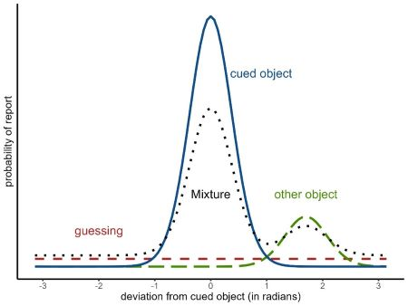

```{=html}
<style type="text/css">
div.main-container {
max-width: 850px !important;
}

p {
margin-top: 1.5em ;
margin-bottom: 1.5em ;
}
.author{
    display: none;
}
</style>
```

```{r, include = FALSE}
options(crayon.enabled = TRUE)
knitr::opts_chunk$set(
  collapse = TRUE,
  comment = "#>",
  dev = "jpeg",
  dpi = 100,
  fig.asp = 0.8,
  fig.align = "center"
)
fansi::set_knit_hooks(knitr::knit_hooks, which = c("output","message","error"))
options(width = 300)

ggplot2::theme_set(tidybayes::theme_tidybayes() + cowplot::panel_border())
```

# Introduction to the models

The two-parameter mixture model [@Zhang_Luck_2008] and the three-parameter mixture model [@Bays_Catalao_Husain_2009] are measurement models for continuous reproduction tasks in the visual working memory domain (for details on the task, see `vignette('vwm-crt')`). As other measurement models for continuous reproduction tasks, their goal is to model the distribution of angular response errors.

The *two-parameter mixture model* (`?mixture2p`) distinguishes two memory states that lead to responses with a mixture of two different distributions of angular errors. The two states are: 

1) having a representation of the cued object with a certain precision of its feature in visual working memory (solid blue distribution in Figure \@ref(fig:mixture-models))

2) having no representation in visual working memory and thus guessing a random response (dashed red distribution). 

```{r mixture-models, echo=F, fig.cap="Mixtures of response distributions", out.width=450}

```


Responses based on a noisy memory representation of the correct feature come from a circular normal distribution (i.e., von Mises) centered on the correct feature value, while guessing responses come from a uniform distribution along the entire circle:

$$
p(\theta) = p_{mem} \cdot \text{vM}(\theta; \mu, \kappa) + (1-p_{mem}) \cdot \text{Uniform}(\theta; -\pi, \pi) \\
$$
$$
p_{guess} = 1-p_{mem} \\
$$
$$
vM(\theta; \mu, \kappa) = \frac{e^{\kappa \cos(\theta - \mu)}}{2\pi I_0(\kappa)}
$$

where $\theta$ is the response angle, $p_{mem}$ is the probability that responses come from memory of target feature, $\mu$ is the mean of the von Mises distribution representing the target feature, and $\kappa$ is the concentration parameter of the von Mises distribution, representing the precision of the target memory representation.   

The *three-parameter mixture model* (`?mixture3p`) adds a third state: confusing the cued object with another object shown during encoding and thus reporting the feature of the other object (long dashed green distribution in Figure \@ref(fig:mixture-models)). Responses from this state are sometimes called non-target responses or swap errors. The non-target responses also come from a von Mises distribution centered on the feature of the non-target object. The probability of non-target responses is represented by the parameter $p_{nt}$, and the complete model is:

$$
p(\theta) = p_{mem} \cdot \text{vM}(\theta; \mu_t, \kappa) + p_{nt} \cdot \frac{\sum_{i=1}^{n} \text{vM}(\theta; \mu_{i}, \kappa)}{n} + (1-p_{mem}-p_{nt}) \cdot \text{Uniform}(\theta; -\pi, \pi) \\
$$
$$
p_{guess} = 1-p_{mem}-p_{nt}
$$

where $\mu_{t}$ is the location of the target feature, $\mu_{i}$ is the location of the i-th non-target feature, $n$ is the number of non-target features.

In most applications of the model, the responses are coded as the angular error relative to the target feature. The same is true for the non-target memory representations, which are assumed to be centered on the target feature, and the precision of the non-target memory representation is assumed to be the same as the precision of the target memory representation. This is the version of the model implemented in the `bmm` package:

$$
p(\theta) = p_{mem} \cdot \text{vM}(\theta; 0, \kappa) + p_{nt} \cdot \frac{\sum_{i=1}^{n}  \text{vM}(\theta; \mu_{i}-\mu_t, \kappa)}{n} + (1-p_{mem}-p_{nt}) \cdot \text{Uniform}(\theta; -\pi, \pi)
$$

# The data

Begin by loading the `bmm` package:

```{r setup, message=FALSE, warning=FALSE}
library(bmm)
```

For this example, we will analyze data from @Bays_Catalao_Husain_2009. The data is included in the `mixtur` R package and can be loaded with the following command:

```{r}
# install the mixtur package if you haven't done so
# install.packages("mixtur")
dat <- mixtur::bays2009_full
```

The data contains the following columns:

```{r, echo=FALSE}
knitr::kable(dat[dat$set_size==4,][1:6,])
```

where:

- `id` is a unique identifier for each participant
- `set_size` is the number of items presented in the memory array
- `response` the participant's recollection of the target orientation in radians
- `target` the feature value of the target in radians 
- `non_target_1` to `non_target5` are the feature values of the non-targets in radians

The trials vary in `set_size` (1, 2, 3 or 6), and also vary in encoding duration.

To fit the mixture models with `bmm`, first we have to make sure that the data is in the correct format. The response variable should be in radians and represent the *angular error relative to the target*, and the non-target variables should be in radians and be *centered relative to the target*. You can find these requirements in the help topic for `?mixture2p` and `?mixture3p`.

In this dataset, the response and non-target variables are already in radians, but they is not centered relative to the target. We can check that by plotting the response distribution. Because memory items are selected at random on each trial, the non-centered responses show a uniform distribution:

```{r fig.width=4, fig.height=3, message=FALSE, warning=FALSE}
library(ggplot2)
ggplot(dat, aes(response)) +
  geom_histogram(binwidth = 0.5, fill = "lightblue", color = "black") +
  labs(title = "Response distribution", x = "Response error (radians)", y = "Frequency")
```

We can center the response and non-target variables by subtracting the target value from them. We can do this with the `mutate` function from the `dplyr` package. We also need to make sure that the response is in the range of $(-\pi, \pi)$, and the non-target variables are in the range of $(-\pi, \pi)$. We can do this with the `wrap` function from the `bmm` package. As we can see from the new plot, the response distribution is now centered on 0.

```{r message=FALSE, warning=FALSE, fig.width=8, fig.height=6, message=FALSE, warning=FALSE}
library(dplyr)
dat_preprocessed <- dat %>%
  mutate(error = wrap(response - target),
         non_target_1 = wrap(non_target_1 - target),
         non_target_2 = wrap(non_target_2 - target),
         non_target_3 = wrap(non_target_3 - target),
         non_target_4 = wrap(non_target_4 - target),
         non_target_5 = wrap(non_target_5 - target),
         set_size = as.factor(set_size))

ggplot(dat_preprocessed, aes(error)) +
  geom_histogram(bins=60, fill = "lightblue", color = "black") +
  labs(title = "Response distribution", x = "Response error (radians)", y = "Frequency") +
  facet_wrap(~set_size)
```

From the plot above we can also see that performace gets substantially worse with increasing set size. Now, we can fit the two mixture models two understand what is driving this pattern.

# Fitting the 2-parameter mixture model with `bmm`

To fit the two-parameter mixture model, we need to specify the model formula and the model. For the model formula we use the `brms` package's `bf` function. 
For all linear model formulas in brms, the left side of an equation refers to the to-be predicted variable or parameter and the right side specifies the variables used to predict it. 

In this example, we want to fit a model in which both the probability of memory responses and the precision of the memory responses vary with set size. We also want 
the effect of set size to vary across participants.

The model formula has three components:

1) The response variable `error` is predicted by a constant term, which is internally fixed to have a mean of 0
2) The precision parameter `kappa` is predicted by set size, and the effect of set size varies across participants
3) The mixture weight[^fn-1] for memory responses `thetat` is predicted by set size, and the effect of set size varies across participants.

[^fn-1]: `brms` does not directly estimate the probabilities that each response comes from each distribution (e.g. $p_{mem}$ and $p_{guess}$). Instead, brms estimates mixing proportions that are weights applied to each of the mixture distributions and they are transformed into probabilities (e.g. $p_{mem}$ and $p_{guess}$) using a softmax normalization. To get $p_{mem}$ we can use the softmax function, that is: $p_{mem} = \frac{exp(\theta_{target})}{1+exp(\theta_{target})}$

```{r}
ff <- bmf(thetat ~ 0 + set_size + (0 + set_size | id),
          kappa ~ 0 + set_size + (0 + set_size | id))
```


Then we specify the model as simply as:

```{r}
model <- mixture2p(resp_error = "error")
```

Finally, we fit the model with the `bmm()` function. The fit model function uses
the `brms` package to fit the model, so you can pass to it any argument that you would pass to the `brm` function. 

```{r}
fit <- bmm(
  formula = ff,
  data = dat_preprocessed,
  model = model,
  cores = 4,
  refresh = 100,
  backend = 'cmdstanr',
  file = "assets/bmmfit_mixture2p_vignette"
)
```

# Results of the 2-parameter mixture model

We can now inspect the model fit:

```{r, out.width=1000, comment=NA}
summary(fit)
```

The summary shows the estimated fixed effects for the precision and the mixture weight, as well as the estimated random effects for the precision and the mixture weight. All Rhat values are close to 1, which is a good sign that the chains have converged. The effective sample sizes are also high, which means that the chains have mixed well.

We now want to understand the estimated parameters. 

- `kappa` is coded within `brms` with a log-link function, so we need to exponentiate the estimates to get the precision parameter. We can further use the `k2sd` function to convert the precision parameter to the standard deviation units.
- `thetat` is the mixture weight for memory responses. As described in footnote 1, we can use the softmax function to get the probability of memory responses. 

```{r}
# extract the fixed effects from the model and determine the rows that contain
# the relevant parameter estimates
fixedEff <- brms::fixef(fit)
thetat <- fixedEff[grepl("thetat",rownames(fixedEff)),]
kappa <- fixedEff[grepl("kappa_",rownames(fixedEff)),]

# transform parameters because brms uses special link functions
kappa <- exp(kappa)
sd <- k2sd(kappa[,1]) 
p_mem <- exp(thetat)/(exp(thetat)+1)
pg <- exp(0)/(exp(thetat)+1)
```

Our estimates for kappa over set_size are:

```{r}
kappa
```

Standard deviation:

```{r}
names(sd) <- paste0("Set size ", c(1,2,4,6))
round(sd,3)
```

Probability that responses comes from memory:

```{r}
rownames(p_mem) <- paste0("Set size ", c(1,2,4,6))
round(p_mem,3)
```

It is even better to visualize the entire posterior distribution of the parameters. 

```{r, message=FALSE, warning=FALSE, fig.show='hold', fig.width=4, fig.height=4, fig.align=NA}
library(tidybayes)
library(tidyr)

# extract the posterior draws
draws <- tidybayes::tidy_draws(fit)
draws_theta <- select(draws, b_thetat_set_size1:b_thetat_set_size6)
draws_kappa <- select(draws, b_kappa_set_size1:b_kappa_set_size6)

# transform parameters because brms uses special link functions
draws_theta <- exp(draws_theta)/(exp(draws_theta) + 1)
draws_kappa <- exp(draws_kappa)

# plot posterior
as.data.frame(draws_theta) %>% 
  gather(par, value) %>%
  mutate(par = gsub("b_thetat_set_size", "", par)) %>%
  ggplot(aes(par, value)) +
  tidybayes::stat_halfeyeh(normalize = "groups", orientation = "vertical") +
  labs(y = "Probability of memory response", x = "Set size", parse = TRUE)

as.data.frame(draws_kappa) %>% 
  gather(par, value) %>%
  mutate(value = k2sd(value)) %>% 
  mutate(par = gsub("b_kappa_set_size", "", par)) %>%
  ggplot(aes(par,value)) +
  tidybayes::stat_halfeyeh(normalize = "groups", orientation = "vertical") +
  labs(y = "Memory imprecision (SD)", x = "Set size", parse = TRUE)
```

where the black dot represents the median of the posterior distribution, the thick line represents the 50% credible interval, and the thin line represents the 95% credible interval.

# Fitting the 3-parameter mixture model with `bmm`

Fitting the 3-parameter mixture model is very similar. We have an extra parameter `thetant` that represents the mixture weight for non-target responses^[because now we have three mixture weights, you will need later to calculate the probability of target responses as $p_{mem} = \frac{exp(\theta_{target})}{1+exp(\theta_{target})+exp(\theta_{nontarget})}$, the probability of non-target responses as $p_{nt} =\frac{exp(\theta_{nontarget})}{1+exp(\theta_{target})+exp(\theta_{nontarget})}$, and the probability of guessing as $p_{guess} = 1-p_{mem}-p_{nt}$]. We also need to specify the names of the non-target variables and the set_size^[When the set_size varies in an experiment, provide the name of the variable containing the set_size information. If the set size is the same for all trials, provide a number, e.g. `set_size=4`] variable in the `mixture3p` function. 

```{r}
ff <- bmf(
  thetat ~ 0 + set_size + (0 + set_size | id),
  thetant ~ 0 + set_size + (0 + set_size | id),
  kappa ~ 0 + set_size + (0 + set_size | id)
)

model <- mixture3p(resp_error = "error", nt_features = paste0('non_target_',1:5), set_size = 'set_size')
```

Then we run the model just like before:

``` r
fit3p <- bmm(
  formula = ff,
  data = dat_preprocessed,
  model = model,
  cores = 4,
  refresh = 100,
  backend = 'cmdstanr'
)
```                 

The rest of the analysis is the same as for the 2-parameter model. We can inspect the model fit, extract the parameter estimates, and visualize the posterior distributions.

In the above example we specified all column names for the non_targets explicitely via `paste0('non_target_',1:5)`. Alternatively, you can use a regular expression to match the non-target feature columns in the dataset. This is useful when the non-target feature columns are named in a consistent way, e.g. `non_target_1`, `non_target_2`, `non_target_3`, etc. For example, you can specify the model a few different ways via regular expressions:

```{r}
model <- mixture3p(resp_error = "error", 
                   nt_features = "non_target_[1-5]", 
                   set_size = 'set_size', 
                   regex = TRUE)
model <- mixture3p(resp_error = "error", 
                   nt_features = "non_target_", 
                   set_size = 'set_size', 
                   regex = TRUE)
```


# References
