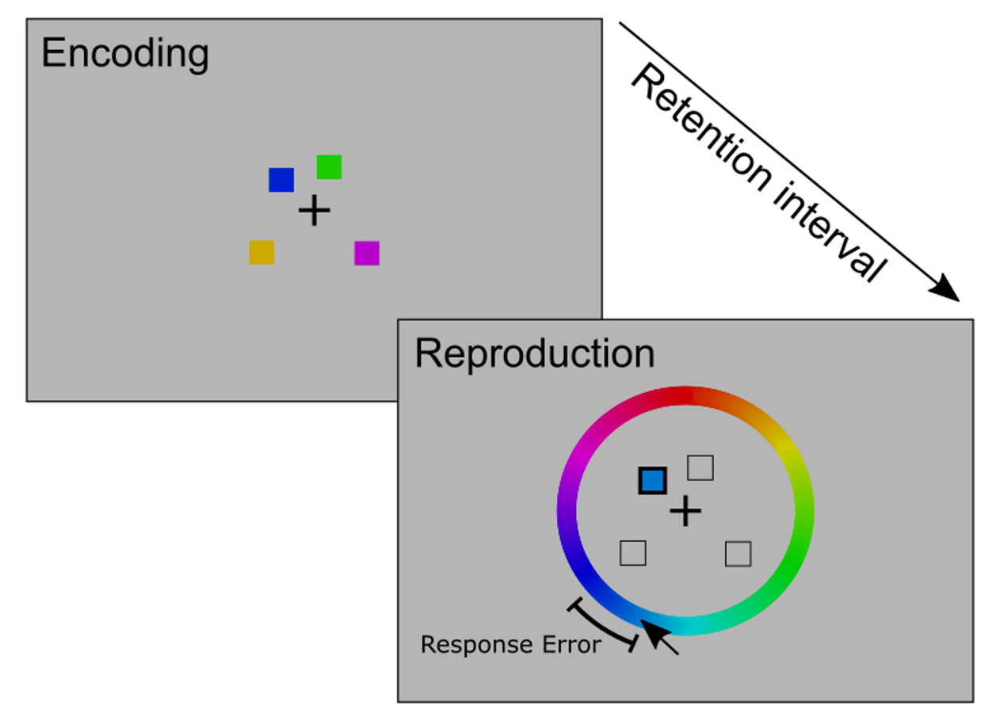

```{=html}
<style type="text/css">
  div.main-container {
    max-width: 800px !important;
  }
  
  p {
    margin-top: 1.5em ;
    margin-bottom: 1.5em ;
  }
</style>
```
```{r, include = FALSE}
knitr::opts_chunk$set(
  collapse = TRUE,
  comment = "#>"
)
```

# Task description

In research on visual working memory participants are often asked to remember and reproduce continuous features of visual objects such as their color or orientation. In the continuous reproduction task (sometimes also called delayed estimation task), participants encode a set of visual objects into visual working memory and are then asked to reproduce a specific feature of one cued object on a continuous scale at test (see Figure \@ref(fig:vwmcrt) for an illustration). 

Most often the features used in these tasks are colors sampled from a color wheel [@Wilken_Ma_2004] or continuous orientations of a bar or a triangle [@Bays_Gorgoraptis_Wee_Marshall_Husain_2011]. The set of to-be-remembered objects typically consists of one up to eight objects spatially distributed over the screen. Thus, participants must associate the to-be-remembered features (e.g. color or orientation) with the spatial locations they are presented at. The precision of the representation of an object’s feature in visual working memory is measured as the angular deviation from the true feature presented at encoding.

```{r vwmcrt, echo=F, fig.cap="A typical continuous reproduction task", out.width=450}

```

# The role of measurement models

In these continuous reproduction tasks, the simplest measure of performance is the average angle deviation of the response from the true feature value. In many studies, this average recall error has been the main dependent variable for evaluating the effect of experimental manipulations. Yet, the average recall error confounds different properties of memory representations and does not sufficiently represent the theoretical processes assumed by current models of visual working memory. Therefore, different measurement models have been proposed to formalize distinct aspects of visual working memory models and how they translate into observed behavior.

A measurement model is a statistical model that describes the relationship between latent cognitive processes and observed behavior. For continuous reproduction tasks, measurement models provide a more refined representation of memory processes because they decompose the average recall error into several theoretically meaningful parameters.

At the core of these models is the assumption that responses in continuous reproduction tasks can stem from different distributions depending on the continuous activation of different memory representation or the cognitive state a person is in at recall.

# CRT Models in the `bmm` package

The `bmm` package implements several measurement models for analyzing continuous reproduction data:

#### The two-parameter mixture model [@Zhang_Luck_2008] {.unnumbered}

  - see `?mixture2p` and `vignette("mixture_models")`

#### The three-parameter mixture model [@Bays_Catalao_Husain_2009] {.unnumbered}

  - see `?mixture3p` and `vignette("mixture_models")`
 
#### The Interference Measurement Model [@Oberauer_Lin_2017]  {.unnumbered}

  - see `?IMM` and `vignette("IMM")`
 
#### The Signal Discrimination Model (SDM) by [@Oberauer_2023]  {.unnumbered}

  - see `?sdm` and `vignette("sdm-simple")`
    
    
# References

